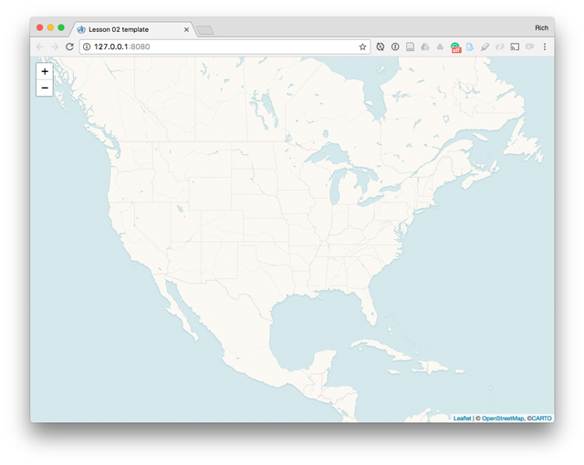
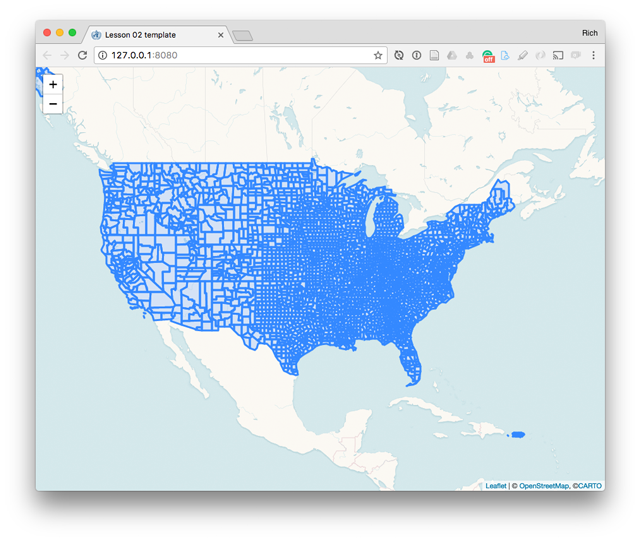
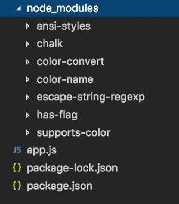
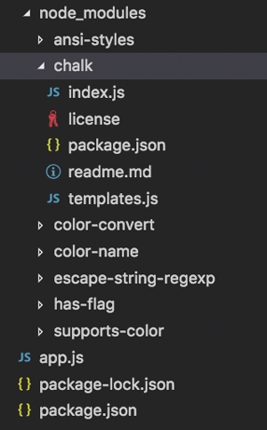
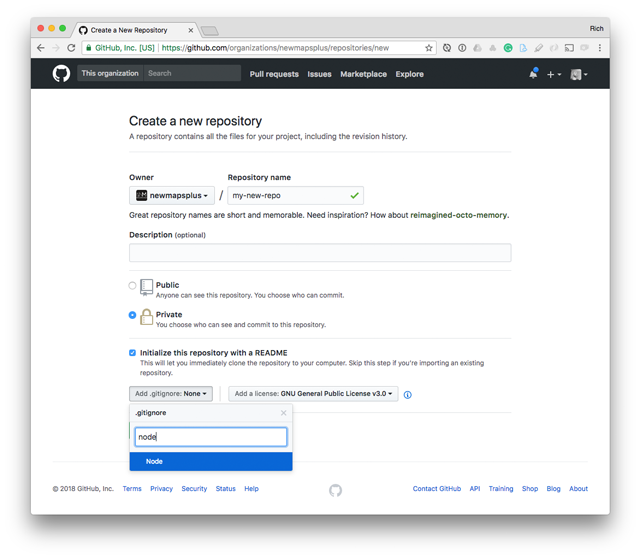
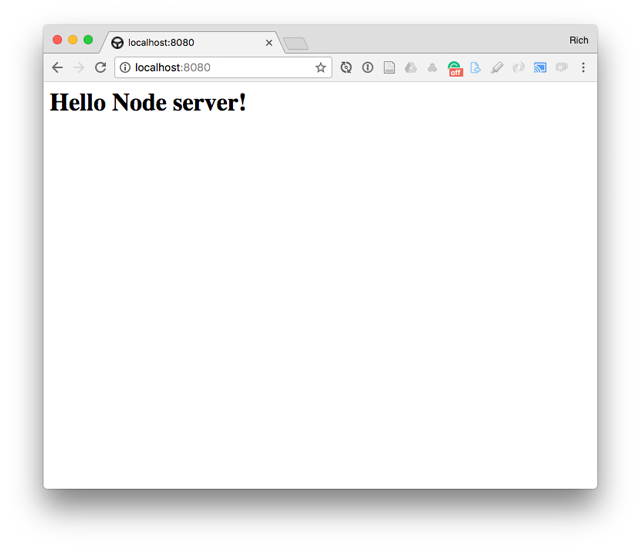
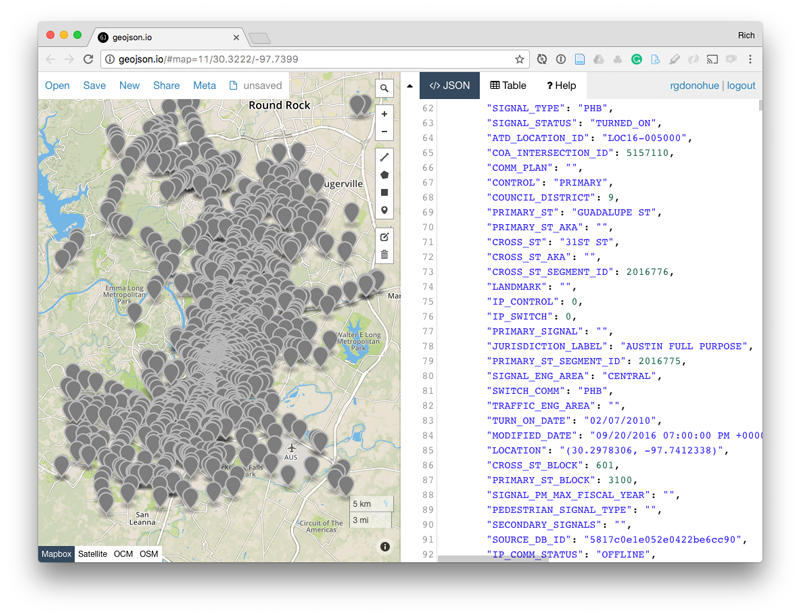
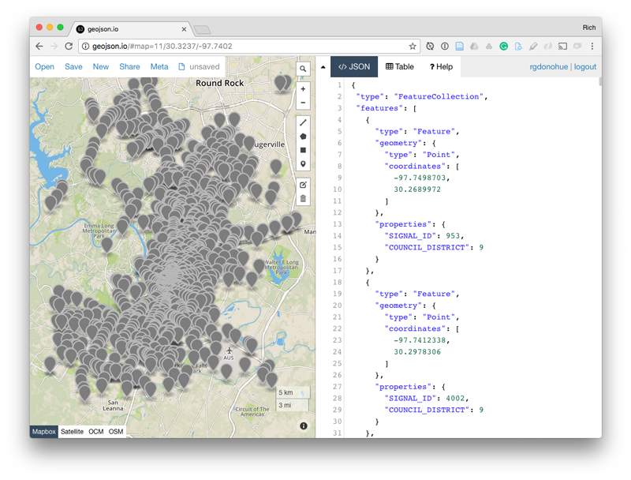

# Assignment 03: Introducing Node.js

Assignment 03 will introduce you to Node and npm, a server-side JavaScript framework. We will learn how to install packages globally using the `-g` flag, such as live-server and the Mapshaper client, which can then be used from any location on the computer system. We will also initialize an npm project for a specific program and track packages installed locally using the _package.json_ file. We will practice Node and using npm by writing several Node scripts for processing JSON and CSV data to produce web-ready GeoJSON files.

## TOC

* [Lesson deliverables](#lesson-deliverables)
* [What are Node and npm?](#what-are-node-and-npm)
    + [Installing Node and npm](#installing-node-and-npm)
* [Getting started with Node](#getting-started-with-node)
    + [Writing a "hello world" script with Node](#writing-a-hello-world-script-with-node)
* [Global use of npm packages for web mapping](#global-use-of-npm-packages-for-web-mapping)
    + [Using the npm live server package for web development](#using-the-npm-live-server-package-for-web-development)
    + [Using the Mapshaper client globally](#using-the-mapshaper-client-globally)
* [Initializing a npm project](#initializing-a-npm-project)
    + [Installing additional packages with npm](#installing-additional-packages-with-npm)
    + [Using the .gitignore file avoid tracking unwanted files and directories](#using-the-gitignore-file-avoid-tracking-unwanted-files-and-directories)
* [Using npm packages](#using-npm-packages)
    + [Using the chalk npm package](#using-the-chalk-npm-package)
* [Using Node to write a simple web server](#using-node-to-write-a-simple-web-server)
* [Using Node to load and process data](#using-node-to-load-and-process-data)
    + [Reading, parsing, and writing JSON system files with Node](#reading-parsing-and-writing-json-system-files-with-node)
      - [Reading JSON data with require()](#reading-json-data-with-require)
      - [Reading and writing JSON files using fs.readFileSync](#reading-and-writing-json-files-using-fsreadfilesync)
      - [Reading and writing JSON files using fs.readFile](#reading-and-writing-json-files-using-fsreadfile)
      - [A quick note on es6 syntax](#a-quick-note-on-es6-syntax)
    + [Parsing and processing CSV data in Node](#parsing-and-processing-csv-data-in-node)
      - [Parsing CSV data into GeoJSON with csv2geojson](#parsing-csv-data-into-geojson-with-csv2geojson)
      - [Binding CSV data to GeoJSON with Node](#binding-csv-data-to-geojson-with-node)
* [Summary and what's next?](#summary-and-whats-next)

## What are Node and npm?

This module introduces us to Node and npm. But what are Node and npm?

As the [nodejs.org](https://nodejs.org) website says,

> Node.js® is a JavaScript runtime built on Chrome's V8 JavaScript engine. Node.js uses an event-driven, non-blocking I/O model that makes it lightweight and efficient. Node.js' package ecosystem, npm, is the largest ecosystem of open source libraries in the world.

So what does that mean? So far throughout New Maps Plus, we've largely been writing JavaScript that gets executed in a client's browser. We either run a local server in which the web page requests the files and executes the code at runtime or someone out there on the web requests these files from a remote server (such as GitHub Pages). The JavaScript runs within the browser when the files are loaded in the web browser.

Node brings the power and flexibility of JavaScript to the server environment. In other words, Node scripts run either on your local machine (for data analysis or development purposes) or on the remote server (in which case they may handle a request for a subset of data).

While there are [ways to run Node scripts in the browser](http://browserify.org/), for the most part, we can think about a Node application as either generating static files to be loaded into the client or running on the server (such as an API for reading/writing data from a remote database).

### Installing Node and npm

One nice thing about Node is that it works across platforms and operating systems!

To get started, install Node.js by one of the following means. The installer will also install npm, which stands for node package manager, globally on your system. We'll be using both of these throughout the rest of this lesson.

* [Node](https://nodejs.org/en/)
* [Get npm!](https://www.npmjs.com/get-npm) (links back to https://nodejs.org/en/)

You can install either the v8 version or the newest v9 version. For our purposes now it doesn't matter which (so go ahead and install the latest).

For future reference, if you end up getting advanced with Node development, there is a [Node Version Manager](https://github.com/creationix/nvm) you can install to switch between different version of Node (though this can be a bit complicated).

When installed correctly, you can open your Terminal and check the version with the command `node -v`:

```bash
$ node -v
v9.11.1
```

If you've successfully installed Node and npm, you'll see a version number (and not an error message). You're good to go!

Read: [What is npm?](https://docs.npmjs.com/getting-started/what-is-npm)

## Getting started with Node

Node and npm don't do much by themselves. We need more JavaScript for that. We can write our own scripts and run them with Node from the command line, or we can use existing packages written by other developers and openly released for all to use. We'll be practicing both.

The following instructions will guide us through some basics of writing a Node script and running it on our local computer. To begin:

1. Open the _map675-module-02-username/assignment-03_ directory in your text editor
2. Open your terminal/command prompt and navigate to the  _map675-module-02-username/assignment-03/_ directory
3. Create a new file within this _map675-module-02-username/assignment-03/_ directory named _app.js_

From what we learned in Module 01, I can do this in the Mac/Unix OS with a `touch` command:

```bash
touch app.js
```

The `ls -li` command will display the list this file within the directory, alongside the _project-files/_ and _images/_ directories :

```bash
$ ls -li
total 264
  72584382 -rw-r--r--   1 NewMaps  staff  72674 Apr 20 16:34 README.md
8602342326 -rw-r--r--   1 NewMaps  staff      0 Apr 20 16:34 app.js
  73471030 drwxr-xr-x  10 NewMaps  staff    320 Oct 23 10:00 images
  74595931 drwxr-xr-x   5 NewMaps  staff    160 Oct 23 10:58 project-files
```

If you created this _app.js_ file with your command prompt, you'd also see the new file in your text editor.

### Writing a "hello world" script with Node

Next, within your text editor write the following JavaScript within _app.js_ and save the file:

```javascript
"use strict"

console.log("hello node");
```

Note that currently we only have a JavaScript file. We could create an HTML page, serve the HTML with a local web server, load that JavaScript file, and then output that console.log statement to the browser's Console. Instead, we're going to run the script within Node's server environment (and not within the web browser).

We can use the `"use strict"` statement at the top of our script to catch additional "silent" errors in the JavaScript and help enforce better syntax as defined by the ECMAScript standard. Read more about [strict mode](https://developer.mozilla.org/en-US/docs/Web/JavaScript/Reference/Strict_mode).

We run Node scripts with the `node` command from our command prompt (terminal). To do so, within your terminal issue the following command,. We'll see the output of our JS statement:

```bash
$ node app.js
hello node
```

Congratulations, you've just run your first Node script! Before we move on to write and run more Node scripts we're going to differentiate between two uses of npm packages: [global and local installations](https://nodejs.org/en/blog/npm/npm-1-0-global-vs-local-installation/).

## Global use of npm packages for web mapping

Below we're going to install and use npm packages for data processing within a specific project. However, an advantage of npm is that we can make these packages globally available to us wherever we are in our file/directory structure. In fact, when you installed Node and npm on your system in the previous section, you installed the default npm packages globally.

To install additional npm packages globally, we include the `-g` flag along with the `npm install` command.

This command will install the npm package on your system within a default root directory. On the Mac OS, Node creates a directory named _node_modules/_ stored here: `/usr/local/lib/node_modules` (for Windows it's likely somewhere here: `C:\Users\{username}\AppData\Roaming\npm`). We don't need to worry too much about where this directory is as we should rarely modify those files. 

Once we've installed a package globally, we have access to it from the command line anywhere on our system.

### Using the npm live server package for web development

If the advantages of the command line and npm aren't blowing your mind yet, wait for this one.

From day one of MAP672, we've stressed how important it is when doing local web mapping development to use a localhost server to correctly request and handle the files used in your web document. We've used packages installed within our text editors such as Brackets' "Live Preview" or "live-server" in Atom. In fact, Atom's plugin uses an npm package called [live-server](https://www.npmjs.com/package/live-server).

 As it's documentation explains:

> The server is a simple node app that serves the working directory and its subdirectories. It also watches the files for changes and when that happens, it sends a message [...] to the browser instructing it to reload.

Once we have Node installed on our system and are familiar with using terminal commands, we can instantly launch live-server from whatever directory we're working within. Install the live-server Node package on your system:

```bash
$ npm install -g live-server
```

We'll see a bunch of output indicating the installation was successful, something similar to this:

```bash
/usr/local/bin/live-server -> /usr/local/lib/node_modules/live-server/live-server.js

> fsevents@1.1.2 install /usr/local/lib/node_modules/live-server/node_modules/fsevents
> node install

[fsevents] Success: "/usr/local/lib/node_modules/live-server/node_modules/fsevents/lib/binding/Release/node-v57-darwin-x64/fse.node" already installed
Pass --update-binary to reinstall or --build-from-source to recompile
+ live-server@1.2.0
added 235 packages in 8.935s
```

We're almost ready to launch live-server, but first, let's build an HTML document with which to test it. Create a new _index.html_ file within your _map675-module-02-username/assignment-03/_ directory and use the following to create a basic map using Leaflet:

```html
<!doctype html>

<html lang="en">

<head>
  <meta charset="utf-8">

  <title>Lesson 02 template</title>
  <link rel="stylesheet" href="https://unpkg.com/leaflet@1.3.1/dist/leaflet.css" />
  <style>
    body {
      font-family: sans-serif;
      margin: 0;
      padding: 0;
    }

    #map {
      position: absolute;
      width: 100%;
      top: 0;
      bottom: 0;
    }
  </style>
</head>

<body>

  <div id="map"></div>

  <script src="https://d3js.org/d3-fetch.v1.min.js"></script>
  <script src="https://unpkg.com/leaflet@1.3.1/dist/leaflet.js"></script>
  <script>
    // map options
    var options = {
      center: [37.265, -94.04],
      zoom: 4
    }
    // instantiate Leaflet map
    var map = L.map('map', options);

    // add CARTO voyager tiles with no labels
    L.tileLayer('https://cartodb-basemaps-{s}.global.ssl.fastly.net/rastertiles/voyager_nolabels/{z}/{x}/{y}.png', {
      maxZoom: 18,
      attribution: '&copy; <a href="http://www.openstreetmap.org/copyright">OpenStreetMap</a>, &copy;<a href="https://carto.com/attribution">CARTO</a>'
    }).addTo(map);

  </script>
</body>

</html>
```

Note that here we're using some new, beautiful raster tiles named "voyager" just released from CARTO. Read about the new tiles here: [Introducing Voyager: The New CARTO Basemap](https://carto.com/blog/new-voyager-basemap/). Also note that you are not allowed to use these tiles for commercial development per CARTO's terms and conditions (but we can enjoy them for these educational purposes).

We've also loaded the [d3-fetch module](https://github.com/d3/d3-fetch) into our script from the CDN. Rather than using JQuery, we'll use this module to make the AJAX request for the data files we process next.

Now we want to launch this page within our web browser. From within your terminal/command prompt (navigated to the root of the _map675-module-02-username/assignment-03/_ directory), simply type the command `live-server`. The output will inform you of where the file server is running and the port (default is 8080):

```bash
$ live-server
Serving "/Users/NewMaps/Documents/mapping/map675/map675-module-02-rgdonohue" at http://127.0.0.1:8080
Ready for changes
```

The package should also automatically open a new web page at http://127.0.0.1:8080, and you should see CARTO's new tiles centered on North America.

  
**Figure 01.** Leaflet map with CARTO's new Voyager tiles.

Now you can use live-server for web map development and don't need to use the editor-specific plugins. If you launch a new instance of live-server from a different directory, it will detect that the default 8080 port is already in use and will launch the directory using another port:

```bash
$ live-server
http://0.0.0.0:8080 is already in use. Trying another port.
Ready for changes
Serving "/Users/NewMaps/Documents/mapping/map675/map675-module-02-rgdonohue" at http://127.0.0.1:56346
```

You can also specify the port you'd like live-server to use:

```bash 
$ live-server --port=3000
Serving "/Users/NewMaps/Documents/NMP/github.newmapsplus/map675/module-02/assignment-03" at http://127.0.0.1:3000
Ready for changes
```

This can be important if you're using a service such as the [Google Sheets API](https://developers.google.com/sheets/api/) to pull in data dynamically. The Google API requires you to whitelist the valid URLs, including a local host address with a specific port number.

Enjoy live-server. Note that if you need to kill the server, you can either hit Cntr-C on your keyboard within the terminal or simply close that terminal window.

Let's now explore using another global npm package before diving back into script writing.

### Using the Mapshaper client globally

If you recall, we ended Module 01 by looking at the amazing [Mapshaper's web interface](http://mapshaper.org/). With it we can upload Shapefiles or GeoJSON files, simplify (remove vertices) the linework to reduce visual clutter and file size, and export to various formats including GeoJSON and Topojson.

We also have Mapshaper's geoprocessing power at our disposal on our system through the [mapshaper npm package](https://www.npmjs.com/package/mapshaper) (much of which was based off OGR).

Install the [Mapshaper client](https://github.com/mbloch/mapshaper/wiki/Introduction-to-the-Command-Line-Tool) globally on your system with the following command:

```bash
$ npm install -g mapshaper
```

Including the `g` flag will install the Mapshaper client globally (or update it on your system if you already have it installed).

We can check to see if the Mapshaper client was installed correctly with a command invoking the `-v` flag:

```bash
$ mapshaper -v
0.4.65
```

If successful, Mapshaper will inform us of the version number value contained within the package's _package.json_ file.

Let's now pull down a big [US counties Shapefile](https://www.census.gov/geo/maps-data/data/cbf/cbf_counties.html) to use with the Mapshaper client (the 20m resolution is good for our purposes here).

First create a directory named _project-files/_, which we'll use to store all our messy source files and tests (rather that the _data_ directory, which we'll use to store our processed files ready for development and production).

Try using terminal commands to create the directory and then download and unzip the file within the _project-files/_ directory (you always have the more manual method as a fallback).

```bash
$ mkdir project-files
$ cd project-files && curl -LOk http://www2.census.gov/geo/tiger/GENZ2016/shp/cb_2016_us_county_20m.zip
$ unzip cb_2016_us_county_20m.zip
Archive:  cb_2016_us_county_20m.zip
  inflating: cb_2016_us_county_20m.shp.ea.iso.xml
  inflating: cb_2016_us_county_20m.shp.iso.xml
  inflating: cb_2016_us_county_20m.shp.xml
  inflating: cb_2016_us_county_20m.shp
  inflating: cb_2016_us_county_20m.shx
  inflating: cb_2016_us_county_20m.dbf
  inflating: cb_2016_us_county_20m.prj
 extracting: cb_2016_us_county_20m.cpg
```

**NOTE:** For the subsequent commands in this section, I have navigated to the _project-files/_ directory in my terminal.

To recall from Module 01, we can use ogr2ogr to get some information about this Shapefile (remember to use the `-so` flag!):

```bash
$ ogrinfo cb_2016_us_county_20m.shp cb_2016_us_county_20m -so
INFO: Open of `cb_2016_us_county_20m.shp'
      using driver `ESRI Shapefile' successful.

Layer name: cb_2016_us_county_20m
Metadata:
  DBF_DATE_LAST_UPDATE=2017-03-10
Geometry: Polygon
Feature Count: 3220
Extent: (-179.174265, 17.913769) - (179.773922, 71.352561)
Layer SRS WKT:
GEOGCS["GCS_North_American_1983",
    DATUM["North_American_Datum_1983",
        SPHEROID["GRS_1980",6378137,298.257222101]],
    PRIMEM["Greenwich",0],
    UNIT["Degree",0.017453292519943295]]
STATEFP: String (2.0)
COUNTYFP: String (3.0)
COUNTYNS: String (8.0)
AFFGEOID: String (14.0)
GEOID: String (5.0)
NAME: String (100.0)
LSAD: String (2.0)
ALAND: Integer64 (14.0)
AWATER: Integer64 (14.0)
Richs-MacBook-Pro:data NewMaps$
```

We see that the Shapefile is currently unprojected and using the geographic coordinate system of GCS\_North\_American_1983. We also note that there are several data attributes that we likely won't need in our final GeoJSON file.

We can alternatively use Mapshaper to inspect a file using the name of the file and the `-info` flag:

```bash
$ mapshaper cb_2016_us_county_20m.shp -info
[info]
Layer 1 *
Layer name: cb_2016_us_county_20m
Records: 3,220
Geometry
  Type: polygon
  Bounds: -179.174265 17.913769 179.773922 71.352561
  Proj.4: +proj=longlat +datum=NAD83
Attribute data
  Field     First value
  AFFGEOID  '0500000US39131'
  ALAND     1140324458
  AWATER       9567612
  COUNTYFP  '131'
  COUNTYNS  '01074078'
  GEOID     '39131'
  LSAD      '06'
  NAME      'Pike'
  STATEFP   '39'
```

Our objective is to now convert this Shapefile data into WGS84 and encoded within a GeoJSON file.

We can use Mapshaper to convert the newly created _counties_wgs84.shp_ file to GeoJSON, simplifying the linework as we do to retain 20% of the vertices.

```bash
$ mapshaper cb_2016_us_county_20m.shp  -simplify dp 20% -o format=geojson ../data/us-counties.json
[simplify] Repaired 2 intersections
[o] Wrote ../data/us-counties.json
```

Again, I'm running this command from within the _project-files/_ directory and this tells Mapshaper to go up one level and into the _data/_ directory to write the _us-counties.json_ file.

Mapshaper will automatically try to repair any intersection issues with the file. The Mapshaper output also informs us that a special character encoding was used to capture some special characters.

Our output file here is 1.6MB (a bit large). We can use some additional options with the mapshaper command to keep only the NAME field and reduce the coordinate precision of the geometry values. **Caution:** Note that the following command will overwrite the previously written _us-counties.json_ file.

```bash
mapshaper cb_2016_us_county_20m.shp -filter-fields COUNTYFP,NAME,STATEFP -simplify dp 15% -o precision=.0001 format=geojson ../data/us-counties.json
[simplify] Repaired 4 intersections
[o] Wrote ../data/us-counties.json
```

Take some time to read [Mapshaper's command line reference](https://github.com/mbloch/mapshaper/wiki/Command-Reference) to understand these various options we're applying:

* `-filter-fields`: allow us to only retain attribute columns we want
* `-simplify`: removes vertices from the polylines or polygons
* `-o`: specifies the output file name, format, and optionally reduces coordinate precision

The second _us-counties.json_ is ~937KB in size and contains only the COUNTYFP, NAME, and STATEFP attribute data.

Again we can use Mapshaper to interrogate the file we just created (note that it has been transformed to WGS84):

```bash
$ mapshaper ../data/us-counties.json -info
[info]
Layer 1 *
Layer name: us-counties
Records: 3,220
Geometry
  Type: polygon
  Null shapes: 22
  Bounds: -179.1743 17.9178 179.7739 71.3526
  Proj.4: +proj=longlat +datum=WGS84
Attribute data
  Field     First value
  COUNTYFP  '131'
  NAME      'Pike'
  STATEFP   '39'
```


We can now load this into our Leaflet map using D3's fetch module to see the results. Modify our existing script from above to use the `d3.json()` method to load the _us-counties.json_ file into the script and have Leaflet project the WGS84 unprojected coordinates to web mercator on the map:

```javascript
d3.json('data/us-counties.json').then(function(data) {
  L.geoJson(data).addTo(map)
});
```

We can see the output in our map provided our paths are correct, and the file conversion was successful:

  
**Figure 02.** County boundaries simplified by Mapshaper and drawn to Leaflet.

Mapshaper is a powerful tool and still under ongoing development, so it's a good one to spend some time playing around with and keep an eye on. I highly recommend you read the [Introduction to the Command Line Tool](https://github.com/mbloch/mapshaper/wiki/Introduction-to-the-Command-Line-Tool) and other pages on the project's GitHub wiki.

We're now going to be writing some basic node scripts to help us process data to make more web maps. We also need to understand better what this whole "npm" business is and how additional Node packages will work within our project.

Let's now initialize a npm project within our _map-675-module-02-username/_ directory.

## Initializing a npm project

Navigate your terminal to the root of the _assignment-03/_ directory. Within the _map675-module-02-username/assignment-03/_ directory (which should now contain your _app.js_ file), type the following command 

```bash
npm init
```

The command `npm` is used to access npm's command line client, which accesses the Node packages we'll be installing in our project. The `npm init` command will give you a bunch of output in the terminal:

```bash
$ npm init
This utility will walk you through creating a package.json file.
It only covers the most common items and tries to guess sensible defaults.

See `npm help json` for definitive documentation on these fields and exactly what they do.

Use `npm install <pkg>` afterward to install a package and
save it as a dependency in the package.json file.
```

The command is then prompting you to enter information for the package. It's common just to hit enter several times rather than entering these values in (or you can use the `--yes` flag to accept all the default values: `npm init --yes` or `npm init -Y`).

```bash
Press ^C at any time to quit.
package name: (map675-module-02-rgdonohue/)
version: (1.0.0)
description:
entry point: (app.js)
test command:
git repository:
keywords:
author:
license: (ISC)
About to write to /Users/NewMaps/Documents/NMP/github.newmapsplus/map675/map675-module-02-rgdonohue/assignment-03/package.json:

{
  "name": "map675-module-02-rgdonohue/",
  "version": "1.0.0",
  "description": "",
  "main": "app.js",
  "scripts": {
    "test": "echo \"Error: no test specified\" && exit 1"
  },
  "author": "",
  "license": "ISC"
}

Is this ok? (yes)
```

When the npm is done initializing the project, notice that within your working directory (i.e., the _map675-module-02-username/_ directory), npm has written a new file named _package.json_. Open the _package.json_ file in your text editor. You'll see it contains a single JavaScript object with key/value properties:

```json
{
  "name": "map675-module-02-rgdonohue/",
  "version": "1.0.0",
  "description": "",
  "main": "app.js",
  "scripts": {
    "test": "echo \"Error: no test specified\" && exit 1"
  },
  "author": "",
  "license": "ISC"
}
```

You may notice that most of these are the same options the command prompt was asking you to fill in above. You can do that now, such as updating the `description` and `author` properties (though don't worry too much about this right now):

```json
{
  "name": "map675-module-02-rgdonohue/",
  "version": "1.0.0",
  "description": "project for exploring Node and npm",
  "main": "app.js",
  "scripts": {
    "test": "echo \"Error: no test specified\" && exit 1"
  },
  "author": "Rich Donohue",
  "license": "ISC"
}
```

The _package.json_ file is used by npm to keep track of packages we'll be installing for this project, as well as running some useful scripts (later on).

Let's install an npm package locally within this project now.

### Installing local packages with npm

What is an npm package? Essentially it's a single project that a contributor or group of collaborating contributors have built and shared with the broader community. These projects most always use Git for version control (and are often hosted within their own GitHub repository) and are documented within the [npmjs.com website](https://www.npmjs.com).

As of this writing, there are over 500,000 packages available through npm (a bit overwhelming, yes). Of course, we're not going to begin to touch a fraction of these, but take a moment to browse through some of the most used npm packages: [most depended-upon packages](https://www.npmjs.com/browse/depended).

We're going to start by installing a fun package named "chalk," which styles our terminal/command prompt output: [chalk](https://www.npmjs.com/package/chalk).

We install new packages within our project using the `npm` command, followed by the `install` option and the package name. By NOT including the `-g` flag, npm installs the package locally within our project:

```bash
npm install <package_name>
```

To install chalk into our project type this command into your terminal:

```bash
npm install chalk
```

You'll see some output in the terminal that may look something like:

```bash
$ npm install chalk
npm notice created a lockfile as package-lock.json. You should commit this file.
npm WARN map675-module-02-rgdonohue/@1.0.0 No repository field.

+ chalk@2.1.0
added 7 packages in 1.332s
```

This output tells us that npm created a file named _package-lock.json_ and that we should commit it (go ahead and do that now).

It also gives us a warning that there's "no repository field." The latter is referring to a Git repository. We can go ahead and add another property to our package.json file so we don't see this warning (feel free to leave the url blank for now):

```json
"repository": {
  "type": "git",
  "url": ""
}
```

The terminal output indicates that the chalk package 2.4.0 has been installed (or whatever the current version is). It also indicates that 7 additional packages were added. What does this mean? Why these additional packages? What and where are they?

Take a moment and look at the files/directories within your text editor. We want to take special note of two things.

First, you'll see that npm automatically added another property to our _package.json_ file:

```json
"dependencies": {
  "chalk": "^2.4.0"
}
```

The `dependencies` property is a record of all the npm packages that we'll use in our project (that our project will "depend on" to run correctly). New packages will be included in this object and will include the package name and the version number.

You'll also see that after the last command (installing chalk) npm also created a new directory within our project named _node_modules/_. This directory is important and contains all the project-specific (i.e., local) npm packages.

If you look within the _node\_modules/_ directory (within the sidebar/explorer) of your text editor, you'll see that there are seven directories within _node_modules/_.

  
**Figure 03.** Contents of the node_modules directory.

Among them we can see _chalk/_, but what are these others? Answer: they are the packages that the chalk package depends on to run (i.e., the package's "dependencies"). Within the _chalk/_ directory we can see several files, one of which is a _package.json_ file. Just like we've created a _package.json_ file for our project with npm, the chalk package has its own _package.json_ used to manage the project.

  
**Figure 04.** Contents of the chalk package.

Now click on (open within your text editor) the _package.json_ file within the _chalk/_ directory. This package file contains a lot of information, but scroll until you see the `dependencies` property:

```json
  "dependencies": {
    "ansi-styles": "^3.2.1",
    "escape-string-regexp": "^1.0.5",
    "supports-color": "^5.3.0"
  }
```

Note that chalk has three packages that it depends upon: [ansi-styles](https://www.npmjs.com/package/ansi-styles), [escape-string-regexp](https://www.npmjs.com/package/escape-string-regexp), and [supports-color](https://www.npmjs.com/package/supports-color). And you'll notice that these three packages are included in the other ones added to the project. But what about the other three directories within the _chalk/_ directory? Can you guess why they also got added to the project when we installed chalk?

Close the chalk package's _package.json_ file if it's open in your editor.

We're going to use the chalk package to style the output of our "hello node" console.log statement. But first, let's take a moment to revisit the other piece of our development puzzle here: Git.

### Using the .gitignore file avoid tracking unwanted files and directories

In the previous steps, we initialized an npm project with `npm init` within the _map675-module-02-username/assignment-03/_ directory, which created the important _package.json_ file. We then installed an npm package from the command line with `npm install chalk`, creating the _node_modules/_ directory which contained seven npm packages (chalk's package and seven dependencies).

Being good developers using Git, we know we should be frequently adding and committing our files and directories to our project. However, we don't need or want to include some files within our repository's Git history. These include very large files and the _node_modules/_ directory. How do we exclude some files from Git?

You'll notice that within the root of the _map675-module-02-username/_ directory there is a file named _.gitignore_. This file specifies what Git should not include when adding and committing files to your repository. While you can create these manually for your projects, this particular one was created using GitHub's default settings when creating the repository, selecting the options under "Node."

  
**Figure 05.** Adding a gitignore file when creating a new repo on GitHub.

Within this _.gitignore_ file you'll see a lot of exclusions that won't apply to this project (and could be deleted). Importantly, note the lines marked as "Dependency directories":

```txt
# Dependency directories
node_modules/
```

These two lines tell Git to ignore any directories within the repository named "node_modules/" (and this recursively and conveniently includes subdirectories as well).

Throughout MAP675 we'll begin to work with some large files that we won't want to include either. Also recall that Git does not track changes within binary files such as Shapefiles, so the use of Github for storing Shapefiles is trivial. We'll be returning to the _.gitignore_ periodically to exclude such files and directories from the Git record.

## Using npm packages

To use an npm package within our script, we first need to make it accessible to our code. To do this, we use Node's [`require()`](https://nodejs.org/api/modules.html#modules_require) module. The `require()` module follows what is described within the [CommonJS module specification](http://www.commonjs.org/) and is used to include additional modules within our project. The module essentially reads JavaScript from the package, executes the code, and then returns an `export` object to be used other places in the overall project.

Fortunately, we don't need to understand what most all of that means (at least right now). Instead, we'll focus on how to use `require()` to load useful or fun packages into our project.

### Using the chalk npm package

Within your _app.js_ file, add the following statement above our console.log statement at the top of the script (we typically require all our packages at the top of the script before the other JavaScript executes).

```javascript
"use strict" 

var chalk = require('chalk');

console.log("hello node");
```

The `require()` function looks for a package (or 'module') of that name within the _node_modules/_ directory. We then assign the result from that function call to a JavaScript variable named `chalk` (we could use any variable name we wish).

Then, within our script, we have access to the public methods provided by the chalk package. For instance, we can output our log statement with a green color:

```javascript
"use strict" 

var chalk = require('chalk');

console.log(chalk.green("hello node"));
```

Then, running the `node app.js` command in our terminal should output our "hello node" in a green color.

Okay, great. But how do we know which methods are available to use for a given package?

The information provided on the npmjs website is a good place to start: [chalk](https://www.npmjs.com/package/chalk). If the package is well-documented (some are and unfortunately some aren't), you'll gain a sense of how to access the package's API, what options you can use, and what methods are available.

You'll notice on the right of the npm page is a link to the Git repository: [https://github.com/chalk/chalk](https://github.com/chalk/chalk). The README.md file of the project's repository is the same information that the npmjs.com is pulling in. But the GitHub repository also gives you access to [known Issues](https://github.com/chalk/chalk/issues) which can offer additional clues and examples (hint: sometimes you need to look through the closed issues to find your solution).

## Using Node to write a simple web server

We know that when we develop web maps on our local machine, we need a web server to request files properly. We've likely been using a web server launched by our powerful text editors: Brackets' "Live Preview" or the "atom-live-server" in Atom. Above we introduced the live-server package, which does just that when used from the command prompt.

We'll now quickly write our own basic local server in Node! This isn't something we'll be using, but rather a demonstration of the kinds of things Node does for us. You'll want to kill your live-server for now if it's still running from earlier.

Within our _map675-module-02-username/assignment-03/_ directory, create a new file named _server.js_.

```bash
touch server.js
```

Open this _server.js_ file in your text editor. Copy the text below into the file and save the changes.

```javascript
"use strict"

var chalk = require('chalk');
var http = require('http');

console.log(chalk.blue('Starting a local web server ...'));

http.createServer(function (req, res) {
  res.writeHead(200, {'Content-Type': 'text/html'});
  res.end('<h1>Hello Node server!</h1>');
}).listen(8080);
```

Notice that we're using another npm package, http. You might be thinking, "well we should install that too using `npm install`"? No, not this time. What!? Why not?

Recall that when we installed Node on our computer, several "core" modules are installed globally on your system and accessible from within any project. You can see these [core modules here](https://nodejs.org/api/modules.html).

We don't need to manually install core modules such as [http](https://nodejs.org/api/http.html) and [fs](https://nodejs.org/api/fs.html). Nor do we need to track them within the _package.json_ file as dependencies when we have Node.js installed on our computer or server.

Within your terminal, run the script:

```bash
$ node server.js
Starting a local web server ...
```

We see our console.log statement output in the terminal, but then nothing seems to happen.

Navigate in your browser to http://localhost:8080. You should see the `<h1>Hello Node server!</h1>` within a rendered web page.

  
**Figure 06.** A heading rendered in a local web page served from a Node script.

We don't need to worry about the ins and outs of this particular script. In fact, it's not terribly useful considering we would need to stop and restart the server (and refresh our browser) for every change we make. It's much better to simply use our live-server package.

If you want to use the latest, cutting-edge web server and web framework for Node development, check out [Express JS](https://expressjs.com/).

Go ahead and hit Control + C on your keyboard to kill the process in your terminal.

So far we've covered how to use npm, the package.json file, and npm packages within a project. We then wrote a simple Node script to serve our files with a static file web server.

Now let's get some more practice loading additional npm packages and writing short scripts to load and process data.

## Using Node to load and process data

The data pipeline to the web map knows many paths and involves many potential tools. Remember that there is no single "right" way to do it. The important thing as a student is to try various ways to solve a problem, learn how to quickly pick up and apply new approaches to existing workflows, and to even get excited to try out new tools.

QGIS and desktop software are great and shouldn't be cast aside simply because we can write scripts to achieve the same thing. You'll likely start to prefer some processes with QGIS and use scripts and commands for others. Increasingly, web interfaces such as [geojson.io](http://geojson.io/) and [Mapshaper](http://mapshaper.org/) give us easy, quick access to powerful GIS processing power. We discover our own preferences as well, the more we work with an assortment of geospatial tools.

This section will begin to familiarize us with using Node scripts to achieve some basic geoprocessing tasks. While GIS or a web interface offers ease of use, scripting gives us complete flexibility and control over the process and offers better ways to automate larger tasks.

### Reading, parsing, and writing JSON system files with Node

Let's begin with the most basic of our data processing needs: loading a file into the script.

As we know, [JSON (JavaScript Object Notation)](http://www.json.org/) is an important format or "data-interchange format" widely used across the DataViz, web mapping, and web development communities. While it's read natively by JavaScript because it's derived from JavaScript objects, it's language independent and plays nicely with many other programming languages such as C++ and Perl. Bottom line: it's a good one with which we store information. And, as we love and know, GeoJSON is based upon the JSON format.

Let's start by loading a JSON file into our script. We'll then use JavaScript to modify the data in some way and write it to a new output JSON file.

We're going to explore three different ways to load JSON files with Node: using a require() statement, and then two different approaches to using another npm package, a core package called "file system" or [fs](https://nodejs.org/api/fs.html). This module allows the Node script to access your file/directory structure and offers synchronous and asynchronous options for doing so.

Take a moment to look at the _cartocolors.json_ file within the _assignment-03/data/_ directory. This JSON file was pulled from [CARTO's "Data-driven color schemes"](https://carto.com/carto-colors/), a beautiful alternative to the now classic [Colorbrewer color schemes](http://colorbrewer2.org/).

While CARTO's [CartoColor GitHub repo](https://github.com/CartoDB/cartocolor) provides these within a `cartocolor.js` file, I pulled out the JSON structure for use within these examples.

#### Reading JSON data with require()

We've already seen how we can load new modules (or "packages") into our Node script with a `require()` statement. While not necessarily the best option, Node will allow us to load JSON files in this way as well.

Create a new directory named _scripts_ at the root of your _map675-module-02-username/assignment-03_ directory. From the _assignment-03_ root:

```bash
mkdir scripts
```

Next, create a new script named _fs-require.js_ at the root of your _map675-module-02-username/assignment-03_ directory (we're going to write several scripts and name them in a useful manner for later reference).

```bash
touch scripts/fs-require.js
```

Write the following code within this script:

```javascript
"use strict"

var colors = require('.../data/cartocolors.json');

console.log(colors);
```

Then, within your terminal/command prompt, run the script with Node. You should see the contents of the _cartocolors.json_ file written to the terminal:

```bash
$ node scripts/fs-require.js
...
  '#99C945',
  '#CC61B0',
  '#24796C',
  '#DAA51B',
  '#2F8AC4',
  '#764E9F',
  '#ED645A',
  '#CC3A8E',
  '#A5AA99' ],
tags: [ 'qualitative' ] } }
```

You'll see a lot of output in the terminal, culminating with the last lines of the _cartocolors.json_ file. 

The `require()` statement loads the file once, caches it in memory, and does so synchronously. Once the JSON object is loaded into our script, we can treat it like a normal JS object, iterate over it, update key values, etc. For instance, to iterate over the elements in this JSON object:

```javascript
var colors = require('../data/cartocolors.json');

for(var color in colors) {
    console.log(color)
}
```

In the terminal output, we can see the property key names:

```bash
$ node fs-require.js
Burg
BurgYl
RedOr
OrYel
Peach
PinkYl ...
```

Using the `require()` statement, therefore, allows us to read JSON file into our script. However, it doesn't provide a way to write information out to a file, so it is of limited utility by itself. Additionally, because it is stored in your computer's cache memory, you'll likely run into trouble loading very large JSON files in this manner.

Better approaches involve using the core Node fs module.

#### Reading and writing JSON files using fs.readFileSync

Another synchronous way to load the file into our script is to use Node's [File System module](https://nodejs.org/api/fs.html), which allows us to access the computer's file system (not surprisingly, given the name of the module).

Create a new file in your _scripts/_ directory named _fs-sync.js_ and write the following code:

```javascript
"use strict"

// load the fs module
var fs = require('fs');

// synchronously request the file
var data = fs.readFileSync(__dirname + '/../data/cartocolors.json');

console.log(data);
```

You may be wondering what that `__dirname` is all about. It's a [Node global object](https://nodejs.org/docs/latest/api/modules.html#modules_dirname) that stores a reference to the directory name of the file we're trying to load. You don't always need to include it when loading files, but I included it in this example so it doesn't throw us off when looking at other examples out there on the web and across various GitHub repos and npm package examples.


Run the script (`node scripts/fs-sync.js` from the root of the _assignment-03/_ directory) in Node and you'll see what may be a surprising output:

```bash
$ node fs-sync.js
<Buffer 7b 0a 20 20 20 20 22 42 75 72 67 22 3a 20 7b 0a 20 20 20 20 20 20 20 2022 32 22 3a 20 5b 0a 20 20 20 20 20 20 20 20 20 20 20 20 22 23 66 66 63 36 63 ... >
```

Node's fs method `readFileSync()` will by default read in the file as what's known as a "buffer," designed to handle raw binary data. The use of buffers is part of why Node is capable of processing data much faster than the JavaScript in our client's browser.

But we're working with text-based JSON data and the buffer representation of the data doesn't do much for us. There are two ways we can parse this buffer into a more useful string.

The first way is to provide an optional character encoding when we request the file. Modify your file in this way:

```javascript
"use strict"

// load the fs module
var fs = require('fs');

// request the file with utf8 character encoding
var data = fs.readFileSync(__dirname + '/../data/cartocolors.json', 'utf8');

console.log(data);
```

Running the script with Node will now output the string representation of the data:

```bash
$ node fs-sync.js
{ "Burg": { "2": [ "#ffc6c4", "#672044" ], ...
```

Great, that works just fine. However, let's introduce one more important way while we're at it. We can parse the buffer into a string representation using JavaScript's native [`JSON.parse()`](https://developer.mozilla.org/en-US/docs/Web/JavaScript/Reference/Global_Objects/JSON/parse) method. Try the following code within your _fs-sync.js_ script:

```javascript
"use strict"

// load the fs module
var fs = require('fs');

// read the file with a synchronous fs request
var rawData = fs.readFileSync(__dirname + '/../data/cartocolors.json');

// data are in raw form 
console.log(rawData); // <Buffer 7b 0a 20 20 20 20 22 42 ...

// use JSON.parse() to parse raw string to JSON
var data = JSON.parse(rawData);

// this looks familiar
console.log(data); // { "Burg": { "2": [ "#ffc6c4", "#672044" ], ...
```

Now that we've loaded our JSON into the script, let's use that data to create a new output file we'll write to the _data/_ directory. Let's say we wish to pluck out a specific color scheme to use within a web map, the quantitative color scheme with the property name of 'Emrld'.

We can do this by declaring a new variable and assigning it the value of an object. We can use the property name `'Emrld'` to access the corresponding object with `data['Emrld']`:

```javascript
// create a new object with key 'Emrld' and value the object
var outputData = {'Emrld': data['Emrld'] };
console.log(outputData);
```

We can verify in the terminal output that we've created a new object with our desired property name and value (the object containing the beautiful CartoColor scheme). 

```bash
{ Emrld:
   { '2': [ '#d3f2a3', '#074050' ],
     '3': [ '#d3f2a3', '#4c9b82', '#074050' ],
     '4': [ '#d3f2a3', '#6cc08b', '#217a79', '#074050' ],
     '5': [ '#d3f2a3', '#82d091', '#4c9b82', '#19696f', '#074050' ],
     '6': [ '#d3f2a3', '#8fda94', '#60b187', '#35877d', '#145f69', '#074050' ],
     '7':
      [ '#d3f2a3',
        '#97e196',
        '#6cc08b',
        '#4c9b82',
        '#217a79',
        '#105965',
        '#074050' ],
     tags: [ 'quantitative' ] } }
```

We now have the single color scheme object stored in memory.

However, to write this to file, we must first use the inverse of the `JSON.parse()` method: `JSON.stringify()`. The following complete script should write our subset of the _cartocolors.json_ file to a file named _emrldcolors.json_:

```javascript
"use strict"

// require the fs module
var fs = require('fs');

// read the file with a synchronous fs request
var rawData = fs.readFileSync(__dirname + '/../data/cartocolors.json');

// use JSON.parse() to parse raw string to JSON
var data = JSON.parse(rawData);

// create a new object with key 'Emrld' and value the object
var outputData = {'Emrld': data['Emrld'] };

// write the output file, stringifying the JS object
fs.writeFileSync(__dirname + '/../data/emrldcolors.json', JSON.stringify(outputData));

console.log('data/emrldcolors.json written to file!');
```

Examine the _emrldcolors.json_ output file in your text editor to verify that we've created the desired data:

```json
{"Emrld":{"2":["#d3f2a3","#074050"],"3":["#d3f2a3","#4c9b82","#074050"],"4":["#d3f2a3","#6cc08b","#217a79","#074050"],"5":["#d3f2a3","#82d091","#4c9b82","#19696f","#074050"],"6":["#d3f2a3","#8fda94","#60b187","#35877d","#145f69","#074050"],"7":["#d3f2a3","#97e196","#6cc08b","#4c9b82","#217a79","#105965","#074050"],"tags":["quantitative"]}}
```

We're now using Node for some data processing, reading and writing files! Good times. Now let's run through a third and asynchronous option and get a better sense of reading the Node API documentation to help us out.

#### Reading and writing JSON files using fs.readFile

The `fs.readFileSync()` and `fs.writeFileSync()` methods read and write files synchronously. This means that the script stops and waits while they do their thing before continuing. This is convenient, largely because it's easier for us to understand.

We've encountered asynchronous JavaScript before, particularly when using JQuery's `$.json()` method to load our files into our JS scripts in the client. As we know, the script will keep on running while the async request happens and if we try to access the result outside of the "callback" function, we'll likely find that result inaccessible or undefined. Consider this example (**don't write this example**):

```javascript
1. // async request for data
2. $.json('mydata.json', function(data) {
3.  // data will be defined
4.  console.log(data);
5. });
6.
7. // data will be undefined
8. console.log(data)
```

As we know, if we were hoping that line 8 would log something other than `undefined` we need to step back and read up more on asynchronous callbacks.

Node is largely designed to work asynchronously. Therefore, the most desirable methods for reading and writing data are the asynchronous methods `fs.readFile()` and `fs.writeFile()`. With the async requests, it's more complicated, but we have much more control over the flow of the script and what errors may be generated in our processing. Using async methods involves making use of callback functions and additional functions we can call within them.

Create a new script named _fs-async.js_ within the root of your _data/_ directory. Paste the following code within the script. The comments help describe what the Node script is doing. We can even include our chalk module from earlier to make the output more fun (and easier) to read.

```javascript
"use strict"

// load the fs module
var fs = require('fs');
var chalk = require('chalk');

// read the file into the script with the readFile() method,
// designating utf-8 character encoding
fs.readFile(__dirname + '/../data/cartocolors.json', function (err, data) {

  // if there is an error loading the data, throw an error 
  if (err) throw error;
  // otherwise, you have access to data here
  // we can log the buffer to the terminal
  console.log(chalk.green("data loaded!"));
  // or send the parsed data as an argument to another function
  extractScheme(JSON.parse(data));
})

function extractScheme(data) {
  // create a new object with key 'Vivid' and value the object
  var outputData = {
    'Vivid': data['Vivid']
  };
  console.log(chalk.magenta('object extracted: '), outputData);
  writeOutputFile(outputData)
}

function writeOutputFile(outputData) {

  // write the data to a new file using the writeFile() method, stringifying the JS object
  fs.writeFile(__dirname + '/../data/vividcolors.json', JSON.stringify(outputData), 'utf-8', function (err) {
    if (err) throw err;
    console.log(chalk.blue('super cool, file written.'));
  });
}
```

Be sure the _fs-async.js_ file is saved and then run with Node:

```bash
$ node scripts/fs-async.js
```

The output gave us some colorful info and if the script ran successfully, you should now see a new file (_vividcolors.json_) written to the _data/_ directory. Open the file in your text editor to examine the content we wrote to the file:

```json
{"Vivid":{"2":["#E58606","#5D69B1","#A5AA99"],"3":["#E58606","#5D69B1","#52BCA3","#A5AA99"],"4":["#E58606","#5D69B1","#52BCA3","#99C945","#A5AA99"],"5":["#E58606","#5D69B1","#52BCA3","#99C945","#CC61B0","#A5AA99"],"6":["#E58606","#5D69B1","#52BCA3","#99C945","#CC61B0","#24796C","#A5AA99"],"7":["#E58606","#5D69B1","#52BCA3","#99C945","#CC61B0","#24796C","#DAA51B","#A5AA99"],"8":["#E58606","#5D69B1","#52BCA3","#99C945","#CC61B0","#24796C","#DAA51B","#2F8AC4","#A5AA99"],"9":["#E58606","#5D69B1","#52BCA3","#99C945","#CC61B0","#24796C","#DAA51B","#2F8AC4","#764E9F","#A5AA99"],"10":["#E58606","#5D69B1","#52BCA3","#99C945","#CC61B0","#24796C","#DAA51B","#2F8AC4","#764E9F","#ED645A","#A5AA99"],"11":["#E58606","#5D69B1","#52BCA3","#99C945","#CC61B0","#24796C","#DAA51B","#2F8AC4","#764E9F","#ED645A","#CC3A8E","#A5AA99"],"tags":["qualitative"]}}
```

To better understand how the fs module reads and writes these files, we must examine the API reference for the [readFile()](https://nodejs.org/api/fs.html#fs_fs_readfile_path_options_callback) and [writeFile()](https://nodejs.org/api/fs.html#fs_fs_writefile_file_data_options_callback) methods. The documentation tells us what required and optional arguments we can use with the method, as well as examples.

#### A quick note on ES6 syntax

If you're studying the example you just wrote above and some of the examples in Node's API documentation, you may be puzzled over some variance in the syntax.

Note the difference between these two chucks of code (in particular how the function callback is written):

```javascript
// ECMAScript Standard v5.1
fs.writeFile(__dirname + '/data/cartocolors.json', data, 'utf-8', function(err) {
  if(err) throw err;
  console.log('done');
});

// es6 syntax
var fileOut = fs.writeFile(__dirname + '/data/cartocolors.json', data, 'utf-8', (err) => {
  if(err) throw err;
  console.log('done');
});
```

These two chunks of code do the same thing in Node, but the latter is written with a newer version of JavaScript, known as "ECMAScript 6 (ES6)" or "ECMAScript 2015" released in June of 2015. The new version of JavaScript is a great improvement over the previous one.

However, it's currently not widely supported by client browsers. To use it you need to "transpile" your ES6 code back into the older version using a tool like [Babel](https://babeljs.io/). Node can run it without transpiling, which is why it works now.

You don't need to worry about mastering ES6 yet, or transpiling scripts with Babel. But it's good to be aware that an increasing number of examples you find on the web will use ES6 (and many more examples in Node). We'll start slowly with this new syntax.

### Parsing and processing CSV data in Node

As we know, often our geographic point data will come in the form of a text-delimited file (CSV, TSV, etc). While we can load CSV data directly into a web map and parse it on the client-side for plotting the points (such as with `d3.csv()`), sometimes we want to pre-process it first.

The following sections will explore two scenarios we may encounter when using CSV data in our process:

1. converting CSV data to GeoJSON
2. aggregating and binding CSV attribute data to GeoJSON polygons

To do so, we'll explore some more nmp packages as well!

Within the _data/_ folder we find a data file of traffic light signals in Austin, TX, provided by the [City of Austin open data portal](https://data.austintexas.gov/): [_austin-traffic-signals.csv_](data/austin-traffic-signals.csv).

Remember it's often helpful to open CSV files in a spreadsheet program to first examine the data and get a sense of the attributes, geospatial data, etc.

The file size is 438KB and contains various many attributes for each of the 1097 point locations, including some redundant data attributes. For instance, there appear to be a couple of attribute columns for lat/long ("LOCATION\_LATITUDE, LOCATION\_LONGITUDE" and "LATITUDE, _LONGITUDE"). We don't need these redundant ones, nor most of the other attributes as well.

#### parsing CSV data into GeoJSON with csv2geojson

We'll now write a node script to convert this CSV into a GeoJSON. There are many npm packages and options for this process (as well as commands using OGR with an accompanying .vrt file, see [this answer](https://gis.stackexchange.com/questions/127518/convert-csv-to-kml-or-geojson-etc-using-ogr2ogr-or-equivalent-command-line-tool?utm_medium=organic&utm_source=google_rich_qa&utm_campaign=google_rich_qa)).

For now we'll practice our Node scripting and explore an npm package appropriately named [csv2geojson](https://www.npmjs.com/package/csv2geojson). If we recall using the [omnivore.js](https://github.com/mapbox/leaflet-omnivore) to load CSV data into our script for mapping with Leaflet, omnivore uses csv2geojson under the hood.

This is not a core node module, so the first step will be to install it in our project:

```bash
npm install csv2geojson
```

We can ignore warnings about a deprecated dependency package for now. If we check our dependences in our _package.json_ file, we'll see that npm updated it with the new module:

```json
  "dependencies": {
    "chalk": "^2.4.0",
    "csv2geojson": "^5.0.2"
  }
```

Great. If we look at the documentation now, we'll see that csv2geojson takes a string of delimited text (like a CSV file) and converts it into a GeoJSON. The documentation offers this simple example:

```javascript
var geoJson = csv2geojson.csv2geojson(csvString, function(err, data) {
  // err has any parsing errors 
  // data is the data
});
```

However, csv2geojson itself won't request our file. For that, we again need the fs package. Since we don't need to install that one, we're ready to require those two packages in our script.

Create a new script named _scripts/csv2geojson.js_ and write the following within it:

```javascript
"use strict"

var fs = require('fs');
var csv2geojson = require('csv2geojson');
```

We can then use the `fs.readFile()` method to pull the file into our script and parse it as text. Note the use of ES6 in this example. Instead of writing `function(err, csvString) {` we omit the `function` keyword and simply write `(err, csvString) => {`:

```javascript
"use strict"

var fs = require('fs');
var csv2geojson = require('csv2geojson')

// read file as string
fs.readFile(__dirname + '/../data/austin-traffic-signals.csv', 'utf-8', (err, csvString) => {

  if(err) throw err

  console.log(csvString) // really long string

});
```

Now we're ready to employ csv2geojson. To do so we use the `csv2geojson.csv2geojson()` method, which we can pass options to. In this case, we can specify the attributes fields containing our latitude and longitude values for each point. We can also specify the delimiter, in this case as a comma.

```javascript
"use strict"

var fs = require('fs');
var csv2geojson = require('csv2geojson')

// read file as string
fs.readFile(__dirname + '/../data/austin-traffic-signals.csv', 'utf-8', (err, csvString) => {

    if(err) throw err;

    // convert to GeoJSON
    csv2geojson.csv2geojson(csvString, {
        latfield: 'LATITUDE',
        lonfield: 'LONGITUDE',
        delimiter: ','
    }, (err, geojson) => {
    
        if(err) throw err;

        console.log(geojson); // this is our geojson!
        
        // write file
        fs.writeFile(__dirname + '/../data/austin-traffic-signals.json', JSON.stringify(geojson), 'utf-8', (err) => {
            
            if(err) throw err;
            
            console.log('done writing file');
        });
    })
});
```

Running this script will, if there are no errors, parse the CSV data, convert it to GeoJSON, and write that to a new file named _austin-traffic-signals.json_. We notice it's a 1.4MB file (so we've increased the size of our datafile from the CSV). But, it's now in GeoJSON, which is a more versatile format and could be used in other processing such as with the [Turf JS library](http://turfjs.org/) (Module 03 of MAP675).

To test the validity of our file, we can load it into our Leaflet map within the _index.html_ file. However, another quick test you should keep in mind is to upload it to [http://geojson.io/](http://geojson.io/). Here we can see the markers added at the feature points (with a lot of attribute data to the right of the screen):

  
**Figure 07.** A CSV file converted to GeoJSON, displayed in geojson.io.

We can think about modifying our script further to deal with all those extra columns we don't need. Yes, you could have used a spreadsheet program to do this manually, but we can also work such processes into our data pipeline.

Unfortunately, csv2geojson doesn't have an option to filter by attributes

Let's consider which fields we want to remove. Since we're not sure what kind of map we're making yet (we're exploring data, not going after data to support the story we know we want to tell ...), let's keep some potentially interesting ones and remove the rest. We're going to be writing a new file, and keeping the script, so if we remove one that we want later, it's easy to return to this step, modify the script, and rerun it!

Which of these fields do we wish to keep?

```javascript
{ type: 'Feature',
  properties:
   { SIGNAL_ID: '953',
     LOCATION_NAME: '5TH ST / RIO GRANDE ST',
     SIGNAL_TYPE: 'TRAFFIC',
     SIGNAL_STATUS: 'TURNED_ON',
     ATD_LOCATION_ID: 'LOC16-004655',
     COA_INTERSECTION_ID: '5155874',
     COMM_PLAN: '',
     CONTROL: 'PRIMARY',
     COUNCIL_DISTRICT: '9',
     PRIMARY_ST: '5TH ST',
     PRIMARY_ST_AKA: '',
     CROSS_ST: 'RIO GRANDE ST',
     CROSS_ST_AKA: '',
     CROSS_ST_SEGMENT_ID: '2018665',
     LANDMARK: '',
     IP_CONTROL: '0',
     IP_SWITCH: '0',
     PRIMARY_SIGNAL: '',
     JURISDICTION_LABEL: 'AUSTIN FULL PURPOSE',
     PRIMARY_ST_SEGMENT_ID: '2018666',
     SIGNAL_ENG_AREA: 'CENTRAL',
     SWITCH_COMM: 'None',
     TRAFFIC_ENG_AREA: '',
     TURN_ON_DATE: '',
     MODIFIED_DATE: '09/20/2016 07:00:00 PM +0000',
     LOCATION: '(30.2689972, -97.7498703)',
     CROSS_ST_BLOCK: '500',
     PRIMARY_ST_BLOCK: '700',
     SIGNAL_PM_MAX_FISCAL_YEAR: '2016',
     PEDESTRIAN_SIGNAL_TYPE: 'UNKNOWN',
     SECONDARY_SIGNALS: '',
     SOURCE_DB_ID: '5817c0cae052e0422be6cbc0',
     IP_COMM_STATUS: 'ONLINE',
     COMM_STATUS_DATETIME_UTC: '05/12/2017 06:59:00 PM +0000',
     OWNER: 'COA',
     DETECTION_STATUS: 'NO DETECTION',
     DETECTION_STATUS_DATE: '',
     CONSTRUCTION_NOTE: '',
     CONSTRUCTION_NOTE_DATE: '',
     LOCATION_LATITUDE: '30.2689972',
     LOCATION_LONGITUDE: '-97.7498703' },
  geometry: { type: 'Point', coordinates: [ -97.7498703, 30.2689972 ] } }
  ```

Let's say we wish to keep only the `SIGNAL_ID` and the `COUNCIL_DISTRICT` attributes for now. There are some potentially interesting temporal attributes, but for now, we'll just keep the map spatial and retain the ID.

We can write a similar script and simply add a JS function to filter out the features we want. Rather than writing the `geojson` to the output file, we'll first send `geojson` into a function which will return a GeoJSON with our desired attributes. The comments below will help explain what's happening.

Create a new file named _scripts/csv2geojson-filtered.js_ and test the following code:

```javascript
"use strict"

var csv2geojson = require('csv2geojson');
var fs = require('fs');

// read file as string
fs.readFile(__dirname + '/../data/austin-traffic-signals.csv', 'utf-8', (err, csvString) => {

  if (err) throw err;

  // convert to GeoJSON
  csv2geojson.csv2geojson(csvString, {
    latfield: 'LATITUDE',
    lonfield: 'LONGITUDE',
    delimiter: ','
  }, (err, geojson) => {

    if (err) throw err;

    var outGeoJSON = filterFields(geojson);

    // write file
    fs.writeFile(__dirname + '/../data/austin-traffic-signals-filtered.json', JSON.stringify(outGeoJSON), 'utf-8', (err) => {

      if (err) throw err;

      console.log('done writing file');
    });
  })
});

function filterFields(geojson) {
  // shorthand to our features
  var features = geojson.features,
      newFeatures = []; // empty array for new features

  // loop through all the features
  features.forEach((feature) => {
    // on each loop, create an empty object
    var tempProps = {};
    // loop through each of the properties for that feature
    for (var prop in feature.properties) {
      // if it's a match
      if (prop === 'COUNCIL_DISTRICT' || prop === 'SIGNAL_ID') {
        // create the prop/value
        tempProps[prop] = feature.properties[prop];
      }
    }
    // now push a new feature to the newFeatures array
    // we will use the existing feature type and geometry,
    // but we can use our new properties as the "properties" value
    newFeatures.push({
      "type": feature.type,
      "geometry": feature.geometry,
      "properties": tempProps
    });
  });
  // finally, return a GeoJSON object FeatureCollection,
  // using the new features as the "features" value
  return {
    "type": "FeatureCollection",
    "features": newFeatures
  }
}
```

Running that script produces a GeoJSON file 156KB in size (compared to the original CSV at 438KB). We've converted the file to the more verbose but versatile GeoJSON and reduced the file size!

Again, we can upload this file to geojson.io to test and verify:

  
**Figure 08.** A CSV file converted to GeoJSON and filtered to retain only some attribute fields, displayed in geojson.io.

Now compare this process with that of doing the conversion and filtering manually in QGIS. Once we have this script in our toolbelt, it's merely a matter of tweaking some variables and applying the script to a new dataset/ Winning!

#### binding CSV data to GeoJSON with Node

Another common task we encounter as web mappers is binding CSV data to GeoJSON feature properties. In MAP673 we studied how this often a desirable task when we have large CSV datasets we prefer to load into the client as CSV (much smaller than GeoJSON). We also discussed how this is advantageous when our web application requests data from a remote source (such as a CARTO database) that needs to be bound to existing geometries (line or polygon) for thematic representation.

However, sometimes we want to process our data beforehand, analyzing CSV data and binding it to feature properties. Let's consider a scenario now when we have Austin county district polygons alongside the data of traffic lights we were just playing with. We want to sum the number of traffic lights within each district and include this one property within our polygon features.

In one sense the traditional GIS solution for this would be to do a point-in-polygon analysis, testing each point against each polygon. However, we also have these data available within the two files given they share a common data attribute: the "COUNCIL_DISTRICT" field values within the CSV data and the "council\_di" field values within the _austin-council-districts.json_ GeoJSON file we produced using the Mapshaper client above.

Therefore, we can use Node JS to loop through these files, test for a match between point and polygon, and increment a numeric counter variable when there is a match. After looping through the CSV file for each polygon, we can include the total count for that polygon in the polygon's feature properties. Finally, we can write that file to output.

We'll practice installing and using another npm package: [csv-parse](https://www.npmjs.com/package/csv-parse).

First, install the package: `npm install csv-parse`

Then create a new file named _data/bind-data.js_ and type the following JavaScript into the file. Save it and run `node bind-data-js` to produce the output (provided there are no errors).

```javascript
"use strict"

const fs = require('fs');
const csvParse = require('csv-parse');

// request first file
fs.readFile(__dirname + "/../data/austin-council-districts.json", 'utf8', (err, geojson) => {
  
  if (err) throw err;
  // nested call for the second (could use Promise or async solution)
  fs.readFile(__dirname + "/../data/austin-traffic-signals.csv", "utf8", (err, csvString) => {
    
    if (err) throw err; // stop the script if error

    // parse the CSV file from text to array of objects
    csvParse(csvString, {
      columns: true
    }, (err, csvData) => {
      
      bindData(JSON.parse(geojson), csvData);

    });
  })
});

function bindData(geojson, csvData) {

  // loop through the features
  geojson.features.forEach((feature) => {

    // set a variable to 0
    let count = 0;

    // loop through the array of CSV data objects
    csvData.forEach((row) => {

      // if IDs match
      if (feature.properties.council_di === row.COUNCIL_DISTRICT) {
        // increment the count for that feature
        count++
      }

    });

    // when done looping, add the count as a feature property
    feature.properties.count = count;

  });

  // done with data bind
  writeFile(geojson);

}

function writeFile(geojson) {

  fs.writeFile(__dirname + '/../data/austin-districts-counts.json', JSON.stringify(geojson), 'utf8', function (err) {

    if (err) throw err;

    console.log('File all done. Great success!');
  })

}
```

If the script ran successfully the output should now include the total count of traffic signal points within each council district (see the count of 76 in the council_di 5 within the GeoJSON):

```json
{"type":"FeatureCollection","features":[{"type":"Feature","properties":{"council_di":"5","count":76},"geometry":{"type":"MultiPolygon","coordinates":[[[[-97.75514500005232,30.263874000727306],[-97.75520499994776,30.263771999447556],[-97.75628299931142,30.261931999576024],[-97.75676499971296,30.261123999989472] ...
```

You'll note that the script uses a terse `if(err) throw err;` statement after the callback functions to throw an error if there is one. Simply throwing an error like this isn't a great practice to use within client-side "production" scripts because you'd want to handle an error gracefully for your user. But since we're just writing Node scripts to process our data on our own machines, throwing an error immediately is useful and sufficient.

This script is a demonstration of the ways we can begin to use Node and JS scripts for data wrangling and processing, and not necessarily an ideal solution. For example, you'll notice that one fs.readFile() request is nested within another. This is okay for two files, but when needing to process anymore than two risks complicated structures known as "callback hell" and would require a better solution (such as using the [Promise object](https://medium.com/dev-bits/writing-neat-asynchronous-node-js-code-with-promises-32ed3a4fd098) or a utility module such as [Async](https://github.com/caolan/async); feel free to experiment).

## Summary

This lesson (Assignment 03) covered a lot of material and introduced you to Node, npm, and various packages useful for continuing to improve our geospatial data pipeline. Be sure your scripts are tidy and lightly commented, and commit them to your repository for submission or help.

Next, move on to [Part I of Assignment 04](../assignment-04/), an individual exercise in web mapping.
